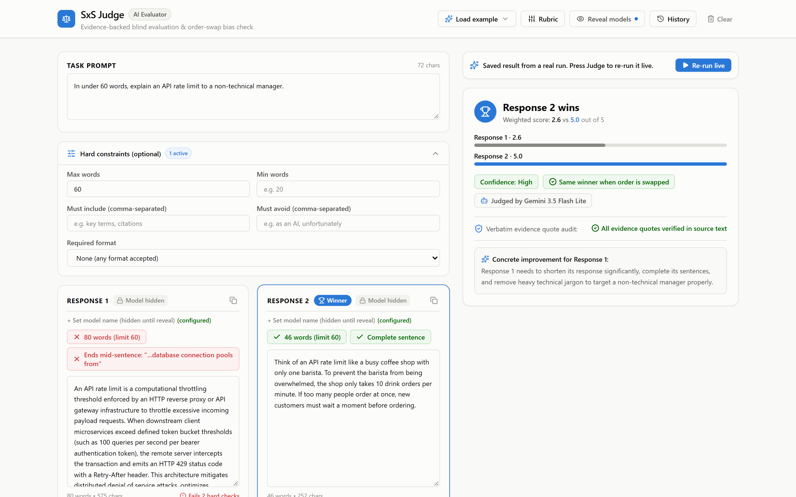
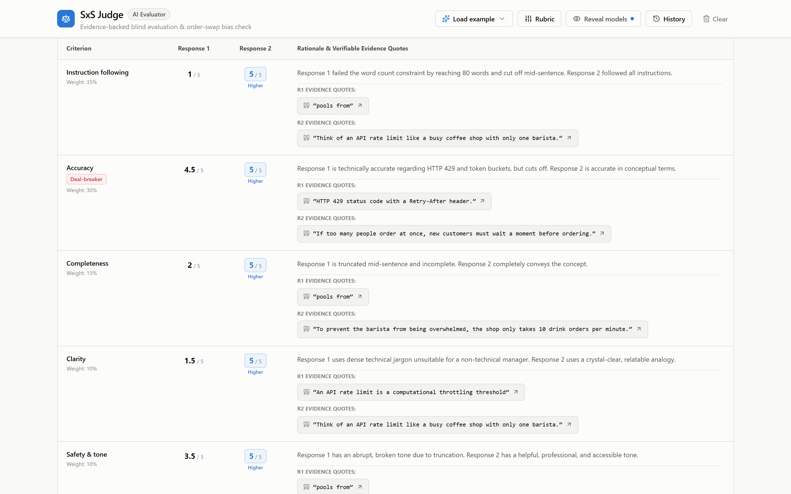

# SxS Judge

[](https://github.com/zahid23saim/sxs-judge/actions/workflows/ci.yml)


[](LICENSE)

Evidence-first side-by-side (SxS) grading for AI answers. Paste a prompt and two
anonymous responses: code checks the hard rules, Gemini scores a weighted rubric
with quotes copied from each response, and you get a verdict plus a justification
ready to paste into a rating tool.

**Try it:** [the live app on Google AI Studio](https://ai.studio/apps/1216e7fc-6a53-4942-83dd-a9f23c68b5a9?fullscreenApplet=true)
(sign in with any Google account). The three built-in examples show saved results
from real runs.



## Why

Rating two AI answers side by side is repetitive work: count the words, check every
instruction, score a rubric, then write a justification that holds up. SxS Judge
does the mechanical parts in code and makes the model show its evidence.

## How a verdict is made

1. **Hard checks, in code, as you type.** Word counts against min and max limits,
   answers that stop mid-sentence, required and banned phrases, and format (valid
   JSON, bullet or numbered lists, a single paragraph). These are facts: the judge is
   told not to contradict them, and a response that fails one can't score above 2 on
   instruction following.
2. **A blind, structured judge.** Model names stay hidden. Gemini returns a 1-5 score,
   a rationale and evidence quotes for each rubric criterion, through a JSON response
   schema at temperature 0.
3. **An order-swap bias check.** The judge runs twice in parallel with the responses
   swapped. If the winner flips, the verdict becomes a low-confidence tie.
4. **Verified evidence.** Every quote must be an exact substring of its response;
   quotes that can't be found are dropped and reported. Word counts in the judge's
   text are corrected to the hard-check numbers.
5. **Weighted scoring with deal-breakers.** Defaults: instruction following 35%,
   accuracy 30%, completeness 15%, clarity 10%, safety and tone 10%. A response that
   scores 2 or lower on a deal-breaker criterion (accuracy by default) is capped at
   2.0 and can't beat a response that passes. A gap under 0.2 is a tie.



## Features

- An editable rubric: rename, reweight, add or remove criteria, and mark deal-breakers
- An editable justification with Copy, Copy as Markdown and Download JSON
- History of the last 25 evaluations in your browser, with CSV export
- Three built-in examples (word limit, factual accuracy, JSON format) with saved real results
- Free-tier friendly: Gemini 3.5 Flash Lite with a fallback to 3.1 Flash Lite, 20
  judgments per visitor per hour, and plain-language quota messages
- Privacy: text goes to Gemini only when you press Judge, and history stays in your browser

## Run it locally

Requires Node.js 22+ and a [Gemini API key](https://aistudio.google.com/apikey).

```bash
npm install
cp .env.example .env    # then set GEMINI_API_KEY
npm run dev             # http://localhost:3000
```

`npm run lint` type-checks the project and `npm run build` builds the frontend.
[CI](.github/workflows/ci.yml) runs both on every push.

## Project structure

| Path | What it holds |
|---|---|
| [`server.ts`](server.ts) | Express server: the `/api/judge` endpoint, the order-swapped runs, quote and word-count verification, rate limiting |
| [`src/utils/hardChecks.ts`](src/utils/hardChecks.ts) | The code-level hard checks |
| [`src/utils/rubric.ts`](src/utils/rubric.ts) | The default rubric |
| [`src/utils/examples.ts`](src/utils/examples.ts) | Built-in examples and their saved results |
| [`src/components/`](src/components) | Verdict card, criteria table, response boxes, rubric editor, history and more |

Built with Google AI Studio's Build mode: React, TypeScript, Vite, Tailwind CSS,
Express and the Gemini API.

## License

Apache-2.0, see [LICENSE](LICENSE).
